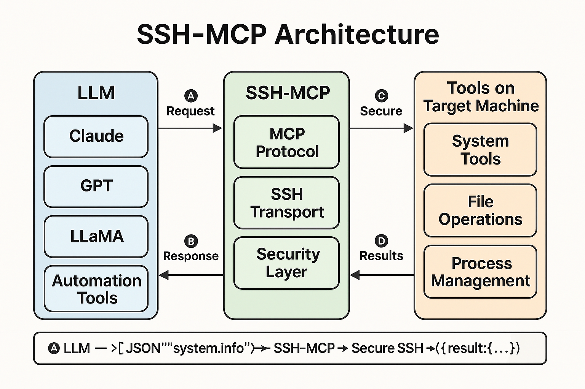

# ssh-mcp: Simple, Secure, Structured AI Tool Execution over SSH


`ssh-mcp` is a **simple, secure, and structured** CLI tool that enables AI agents and developers to execute JSON-based commands over SSH using the Model Context Protocol (MCP).

**The missing bridge between AI and ops.**

It acts as a bridge between AI systems (like Claude, LLaMA, GPT) and real-world system operations, allowing tools, prompts, and resource-based interactions through a structured protocol.

<details>
<summary>📚 Table of Contents</summary>

- [Current Status](#-current-status)
- [The Problem](#-the-problem)
- [The Solution](#-the-solution)
- [Key Benefits](#-key-benefits)
- [Who Should Use This](#-who-should-use-this)
- [Use Cases](#-use-cases)
- [Comparison to Alternatives](#-comparison-to-alternatives)
- [Protocol Design](#-protocol-design)
- [Quick Start](#-quick-start)
- [Prerequisites](#-prerequisites)
- [Features](#-features)
- [Tool Categories](#-tool-categories)
- [AI Integration Example](#-ai-integration-example-python)
- [Chat / REPL Support](#-chat--repl-support)
- [Roadmap](#-roadmap)
- [License](#-license)
- [Architecture Diagram](#-architecture-diagram)
- [References & Related Projects](#-references--related-projects)
- [Get Involved](#-get-involved)

</details>

---

## 📌 Current Status

> **🚧 Under active development** – MVP Bash implementation available. Go version and package manager support coming soon.

---

## ❓ The Problem

SSH works great for people. But for AI agents and automated devtools?

- There's no structure — just raw text output
- No arguments, schemas, or results
- No streaming, prompting, or metadata

**Result:** AI agents can't reliably automate remote tasks. Devtools can't reason with responses. And humans must glue everything together.

---

## ✅ The Solution

**`ssh-mcp` makes SSH structured, predictable, and AI-friendly.**

- Wrap any remote tool as a JSON-based callable
- Interact with remote machines using structured requests
- Return consistent results with explanations and suggestions
- Secure-by-default using existing SSH keys

---

## ✨ Key Benefits

| Feature            | Description                                   |
| ------------------ | --------------------------------------------- |
| ✅ **Simple**       | One binary or bash script, zero dependencies  |
| 🔐 **Secure**      | Uses existing SSH auth (no daemon, no socket) |
| 📦 **Structured**  | MCP protocol for inputs, outputs, context     |
| 🤖 **AI-Ready**    | Built for agents, LLMs, auto-devtools         |
| ⚙️ **Extensible**  | Add your own tools, prompts, resources        |

---

## 👥 Who Should Use This

If you're building:

- AI tools that talk to real infrastructure
- Developer copilots that touch live servers
- Secure automations that need structured control

...then `ssh-mcp` helps you move fast *without sacrificing control or safety.*

---

## 💡 Use Cases

- 💻 Developers: Structured command execution over SSH
- 🤖 AI Agents (Claude, GPT, LLaMA): Natural language → structured tool invocation
- 🛠️ Automation: Run predefined tools, long-running ops, and observability
- 👨‍💻 Replit / Cursor / AutoGPT: Drop-in remote tool layer

---

## ⚖️ Comparison to Alternatives

| Feature           | Raw SSH | REST APIs | ssh-mcp |
| ----------------- | ------- | --------- | ------- |
| Structured Output | ❌       | ✅         | ✅       |
| Schema-based Args | ❌       | ✅         | ✅       |
| Streaming Support | ❌       | Limited   | ✅       |
| Requires Daemon   | ❌       | Usually   | ❌       |
| Secure by SSH     | ✅       | ❌         | ✅       |
| AI Prompt Support | ❌       | ❌         | ✅       |

---

## ⚙️ Protocol Design

### Request Format

```json
{
  "tool": "string",
  "args": {
    "property1": "value1"
  },
  "conversation_id": "uuid",
  "context": {
    "user_intent": "string",
    "reasoning": "string"
  }
}
```

### Response Format

```json
{
  "conversation_id": "uuid",
  "status": { "code": 0, "message": "Success" },
  "result": { "property1": "value1" },
  "explanation": "string",
  "suggestions": [
    { "tool": "string", "description": "string" }
  ],
  "error": {
    "code": "string",
    "message": "string",
    "details": {}
  }
}
```

---

## ⚡ Quick Start

```bash
# 1. Install
git clone https://github.com/sameehj/ssh-mcp.git
cd ssh-mcp
chmod +x install.sh
./install.sh

# 2. Run a tool
echo '{"tool":"system.info"}' | ssh-mcp user@host
```

> Note: Package manager support (`brew`, `apt`, `scoop`) is planned for future releases.

---

## 🔐 Prerequisites

- SSH access to the target system
- Bash and `jq` installed on remote machine
- Key-based auth recommended

---

## 🚀 Features

- Full MCP Protocol support
- Tools, prompts, and resource handling
- Conversation tracking and AI context embedding
- Structured error handling, suggestions, explanations
- Shell completions, self-discovery, tool schemas

---

## 📊 Tool Categories

### Meta Tools

- `meta.discover`: List tools
- `meta.describe`: Tool descriptions
- `meta.schema`: Tool input schema

### System Tools

- `system.info`: OS, CPU, memory
- `system.health`: Disk, load, uptime

### File Tools

- `file.read`, `file.write`, `file.list`, `file.find`

### Process Tools

- `process.list`, `process.info`

### Network Tools

- `network.status`, `network.route`

### Resources

- `resource.get`, `resource.list`, `resource.create`

### Long-Running

- `longRunning.backup`, `longRunning.scan`, `longRunning.download`

---

## 🤖 AI Integration Example (Python)

```python
import json, subprocess, uuid

class McpClient:
    def __init__(self, server):
        self.server = server
        self.conversation_id = str(uuid.uuid4())

    def execute_tool(self, tool_name, args=None, user_intent=None):
        payload = {
            "tool": tool_name,
            "args": args or {},
            "conversation_id": self.conversation_id,
        }
        if user_intent:
            payload["context"] = {"user_intent": user_intent}

        result = subprocess.run([
            "ssh", self.server, "./mcp.sh"
        ], input=json.dumps(payload).encode(), stdout=subprocess.PIPE)
        return json.loads(result.stdout)
```

---

## 💬 Chat / REPL Support

Use `ssh-mcp` in conversational loops or LLaMA-based shells:

```bash
while true; do
  echo -n "mcp > "
  read CMD
  echo $CMD | ssh-mcp user@host
done
```

Pair this with a local LLM (e.g. LLaMA) to enable:

> "Check CPU usage" → `{ "tool": "system.monitor" }`

---

## 🔮 Roadmap

- ✅ Bash-based MVP (`mcp.sh`)
- 🚧 Go binary version (`ssh-mcp`)
- 🚧 Streaming support for long-running tools
- 🚧 Resource references: inline or URI-based
- 🚧 Prompt + tool hybrid execution
- 🚧 Plugin architecture for third-party tools
- 🚧 Package manager support (`brew`, `apt`, `scoop`)
- 🚧 Shell completions and `--discover`/`--describe`
- 🚧 Integration with Claude, Cursor, Replit AI agents

---

## 🪧 License

MIT License — see `LICENSE` file for details.

---

## 🎯 Architecture Diagram



---

## 🔎 References & Related Projects

- MCP Protocol *(early-stage spec)*
- MCP Specification *(draft)*
- ClaudeMCP *(conceptual integration)*
- [KernelFaaS (eBPF backend)](https://github.com/Kiinitix/KernelFaaS)

---

## 🎉 Get Involved

Want to contribute tools, prompts, or ideas? Want to use `ssh-mcp` with your AI shell, devtool, or infra layer?

Let's build it together. Star the repo, fork it, or open an issue.

---

### 🚀 Let's Build the AI Shell of the Future

> `ssh-mcp` is more than a CLI — it's a protocol for building intelligent, secure interfaces between humans, AI, and machines.

- ⭐ Star the repo
- 🛠️ Contribute a tool or prompt
- 💬 Tell us what you're building

This is the terminal AI deserves.